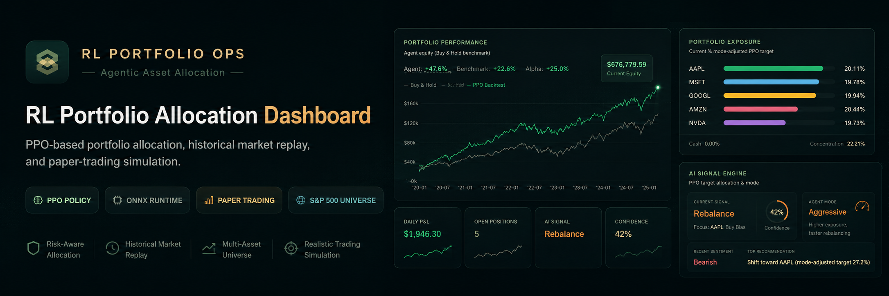
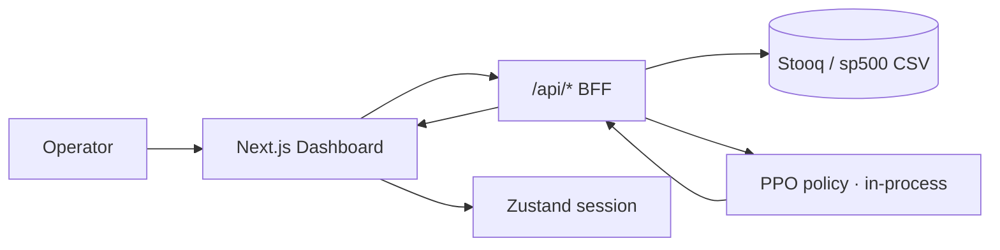

<p align="center">
  
</p>

<h1 align="center">RL Portfolio Allocation Dashboard</h1>

<p align="center">
  <strong>Next.js · TypeScript · Tailwind · Recharts · PPO / ONNX · Paper trading</strong><br />
  <em>Research dashboard for PPO-based portfolio allocation, historical market replay, and simulated execution.</em>
</p>

<p align="center">
  <a href="https://github.com/sidnei-almeida/ai-trading-signals-dashboard"><strong>View on GitHub</strong></a>
  &nbsp;·&nbsp;
  <a href="https://github.com/sidnei-almeida/deep-rl-trading-agent">PPO training repo</a>
</p>

<p align="center">
  
  
  
  
  
  
  
  
</p>

---

## What this is

A **dark, operations-style dashboard** for reinforcement-learning portfolio allocation research. It surfaces PPO target weights, mode-adjusted guardrails, historical equity replay, and a full **paper-trading control plane** — without claiming live brokerage connectivity.

The UI loads market and policy data through **Next.js BFF routes** (`/api/*`). **There is no external model server:** the PPO policy runs inside the Next.js process, so a Vercel deployment is fully self-contained — no cold starts, no third-party inference host.

> **Inference:** PPO policy for a fixed **S&amp;P 500 tech basket** (AAPL, MSFT, GOOGL, AMZN, NVDA), trained in [deep-rl-trading-agent](https://github.com/sidnei-almeida/deep-rl-trading-agent) and exported from `ppo_policy_100k.onnx`.

### How the model runs on Vercel

The exported ONNX graph is a small MLP — `11 → 64 → 64 → 5`, `tanh` activations, ~10k float32 parameters, Gemm and Tanh operators only. Instead of bundling an ONNX runtime into the serverless function, `scripts/export-ppo-weights.py` extracts the tensors into `src/lib/ppo/ppo-weights.ts` (base64 float32) and `src/lib/ppo/policy.ts` replays the forward pass in plain TypeScript.

- **Zero runtime dependencies** — no `onnxruntime`, no native binaries, no model download at boot
- **Deterministic** — inference returns the Gaussian mean rather than sampling `N(mean, exp(log_std))`, so curves are reproducible across requests
- **Verified** — outputs match ONNX Runtime to `~1e-8` relative error across a full 2,516-day backtest
- **Fast** — the complete backtest (2,516 policy evaluations) runs in well under 100 ms

---

## Pages & workflow

| Route | Purpose |
|-------|---------|
| **Overview** `/` | KPI strip, portfolio performance vs buy &amp; hold, AI signal engine, exposure, market watch, guardrails, execution queue, activity feed |
| **Portfolio** `/portfolio` | Analytics KPIs, performance / drawdown / return distribution, holdings, correlation heatmap, contribution breakdown |
| **Policy Inference** `/policy` | Model metadata, observation snapshot, PPO output, inference diagnostics |
| **Risk Controls** `/risk` | Guardrail status, exposure, rebalance risk review, blocked legs, limit utilization, simulated queue |
| **Market Watch** `/watch` | KPI strip, price table &amp; trends, signal breakdown, data-source status |
| **Settings** `/settings` | Operating mode, guardrails, API &amp; session, replay, agent runtime, safety &amp; reset |



---

## Main features

### Overview & session control

- **KPI strip** — net worth, daily P/L, open positions, AI signal, confidence, sentiment, risk exposure, operating mode
- **Portfolio performance** — agent equity vs buy &amp; hold; live replay overlay; 30d / 90d / all ranges
- **AI Signal Engine** — mode-adjusted signal, agent persona, confidence bar, regime, thesis
- **Top bar controls** — start / pause / reset / rebalance simulation / emergency stop
- **Operating modes** — Conservative · Balanced · Aggressive (guardrails + rebalance intensity)

### Portfolio analytics

- Drawdown and return-distribution charts
- Per-asset exposure bars with shared color palette
- Correlation heatmap and contribution breakdown
- Holdings table with PPO targets and allocation deltas

### Policy & risk

- **PPO policy output** — softmax weights over the in-process policy inference
- **Observation snapshot** — vector fed to the policy (collapsible raw view)
- **Guardrail monitoring** — utilization, blocked recommendations, rebalance step limits
- **Simulated execution queue** — legs with guardrail column on Risk page

### Market watch & replay

- Normalized multi-asset price trend (replay cursor)
- Signal breakdown (buy / hold / sell bias counts and deltas)
- **Historical replay engine** — day-by-day paper session over Stooq `price_history`
- Data-source strip (Stooq OHLCV vs bundled close-only CSV)

### Settings & safety

- Guardrail sliders synced to operating mode
- Session reset, activity feed clear, guardrail restore, dashboard refresh
- Developer diagnostics (collapsible)

---

## Design system

Built for long monitoring sessions: low-glare **noir** base, **wasabi** secondary text, **khaki** primary values, **earth** accent for warnings and CTAs.

| Element | Implementation |
|---------|----------------|
| **Typography** | [Sora](https://fonts.google.com/specimen/Sora) (UI) + [IBM Plex Mono](https://fonts.google.com/specimen/IBM+Plex+Mono) (tickers, metrics, tables) via `next/font` |
| **Brand mark** | Emerald tile + layers glyph — `src/components/brand/brand-logo-mark.tsx`, favicon, web manifest |
| **Cards** | `#1a2826` panels, `rgba(128,144,118,0.12)` borders, nested tiles `#223330` |
| **Charts** | Per-asset palette (AAPL green · MSFT blue · GOOGL khaki · AMZN earth · NVDA purple); agent line `#4ade80` |
| **Tables** | IBM Plex Mono headers `#5a6b5e`; khaki tickers; semantic positive / negative cells |
| **Sidebar** | Collapsible nav groups (Main · Control · System); mode switcher; session status chip |

Tokens and overrides live in `src/app/dashboard-theme.css`, `src/app/globals.css`, and `src/lib/chart-styles.ts`.

---

## Operating modes

| Mode | Behavior (summary) |
|------|---------------------|
| **Conservative** | Lower exposure, slower rebalancing, higher cash reserve |
| **Balanced** | Default guardrails and rebalance intensity |
| **Aggressive** | Higher single-asset cap, faster reaction to PPO targets |

Mode changes are logged in the **Signal &amp; Execution Feed** as simulated operator events.

---

## Tech stack

| Layer | Choice |
|-------|--------|
| Framework | Next.js 16 (App Router) |
| Language | TypeScript |
| Styling | Tailwind CSS v4 + dashboard theme CSS |
| UI primitives | shadcn / Radix |
| Charts | Recharts 3 |
| State | Zustand (persisted session) |
| Icons | Lucide React |
| Data | BFF routes + bundled CSV history |
| Inference | PPO weights exported from ONNX, replayed in TypeScript |

---

## Environment

Copy `.env.example` to `.env.local`:

```env
# Production URL (Vercel) — Open Graph, manifest, canonical links
# NEXT_PUBLIC_SITE_URL=https://your-app.vercel.app

# Optional: override the remote sp500.csv used when no CSV ships with the build
# MARKET_DATA_SP500_CSV_URL=

# Stooq CSV download only (npm run data:stooq — server-side, never exposed to browser)
# STOOQ_API_KEY=
# STOOQ_START_DATE=20200101
# STOOQ_END_DATE=20260527
```

| Variable | Purpose |
|----------|---------|
| `NEXT_PUBLIC_SITE_URL` | Canonical URL on Vercel (recommended in production) |
| `MARKET_DATA_SP500_CSV_URL` | Fallback price history, only if no CSV is present on disk |
| `STOOQ_*` | Optional historical CSV ingest via `scripts/download-stooq-data.ts` |

---

## Quick start

```bash
git clone https://github.com/sidnei-almeida/ai-trading-signals-dashboard.git
cd ai-trading-signals-dashboard

npm install
cp .env.example .env.local

# Optional: download Stooq historical prices into data/market/
npm run data:stooq

npm run dev
```

Open [http://localhost:3000](http://localhost:3000).

> **Note:** No external service is required. `data/sp500.csv` ships with the repository, so the dashboard replays a full PPO backtest out of the box; `npm run data:stooq` upgrades it to full OHLCV bars.

### Production build

```bash
npm run build
npm start
```

---

## Deploy on Vercel

1. Import this repository on [Vercel](https://vercel.com).
2. Framework preset: **Next.js** (default).
3. Recommended environment variables:

   | Variable | Example |
   |----------|---------|
   | `NEXT_PUBLIC_SITE_URL` | `https://your-app.vercel.app` |

4. Deploy. No inference service to provision — the policy weights are part of the bundle.

Favicon, Apple touch icon, `site.webmanifest`, and Open Graph image are generated from `src/app/icon.svg`, `src/app/apple-icon.svg`, and `src/app/opengraph-image.tsx`.

---

## Repository structure

```
ai-trading-signals-dashboard/
├── public/
│   ├── brand/logo-mark.svg       # Brand mark (favicon source)
│   └── site.webmanifest
├── images/
│   └── header.png                # README hero banner
├── data/
│   ├── sp500.csv                 # Bundled close-only history (2015 →)
│   └── market/prices.csv         # Stooq ingest output (gitignored)
├── models/
│   └── ppo_policy_100k.onnx      # Source checkpoint for the weight export
├── scripts/
│   ├── download-stooq-data.ts
│   └── export-ppo-weights.py     # ONNX → src/lib/ppo/ppo-weights.ts
├── src/
│   ├── app/
│   │   ├── (dashboard)/          # Overview, Portfolio, Policy, Risk, Watch, Settings
│   │   ├── api/                  # BFF: dashboard-data, health, predict, market-data
│   │   ├── icon.svg · apple-icon.svg · opengraph-image.tsx
│   │   └── layout.tsx
│   ├── components/
│   │   ├── brand/                # BrandLogoMark
│   │   ├── charts/               # Performance, drawdown, allocation, …
│   │   ├── dashboard/            # Shared panels (KPI, signal engine, queue, …)
│   │   ├── layout/               # Sidebar, topbar, shell
│   │   ├── market-watch/ · portfolio/ · policy/ · risk/ · settings/
│   │   └── ui/                   # shadcn primitives
│   ├── hooks/                    # Bootstrap, replay, market watch, analytics
│   ├── lib/                      # Metrics, replay, operating modes
│   │   └── ppo/                  # Weights, TypeScript policy, backtest
│   ├── store/                    # Zustand dashboard store
│   └── types/rl-trading.ts
├── readme_model.md               # README style reference
├── .env.example
└── package.json
```

---

## API surface (BFF)

The browser calls same-origin routes; all model and data work happens server-side in the same deployment.

| Route | Role |
|-------|------|
| `GET /api/dashboard-data` | Full PPO backtest over the bundled history — equity, benchmark, allocations |
| `GET /api/health` | Policy self-test (loads weights, runs a probe observation) |
| `POST /api/predict` | PPO inference for one 11-dim observation |
| `GET /api/market-data` | CSV prices for Market Watch |

`POST /api/predict` takes `{ "observation": [cash, ...5 share counts, ...5 prices] }` and returns `raw_action` (policy logits), `allocations` (softmax weights), and the critic `value`.

---

## Data sources

| Source | When used |
|--------|-----------|
| **Stooq CSV** | `data/market/prices.csv` after `npm run data:stooq` — full OHLCV historical replay |
| **Bundled sp500.csv** | `data/sp500.csv`, committed close-only history — the default in a fresh deployment |
| **Remote sp500.csv** | `MARKET_DATA_SP500_CSV_URL`, only if neither file is on disk |

Universe: **AAPL · MSFT · GOOGL · AMZN · NVDA** (see `src/lib/constants.ts`).

---

## Disclaimer

This project is a **research and paper-trading demonstration**. PPO outputs, simulated rebalances, and dashboard signals are **not investment advice** and do not constitute live trading instructions. Always validate models, data, and guardrails before any real capital deployment.

---

## Author

**Sidnei Alves de Almeida** — [@sidnei-almeida](https://github.com/sidnei-almeida)
